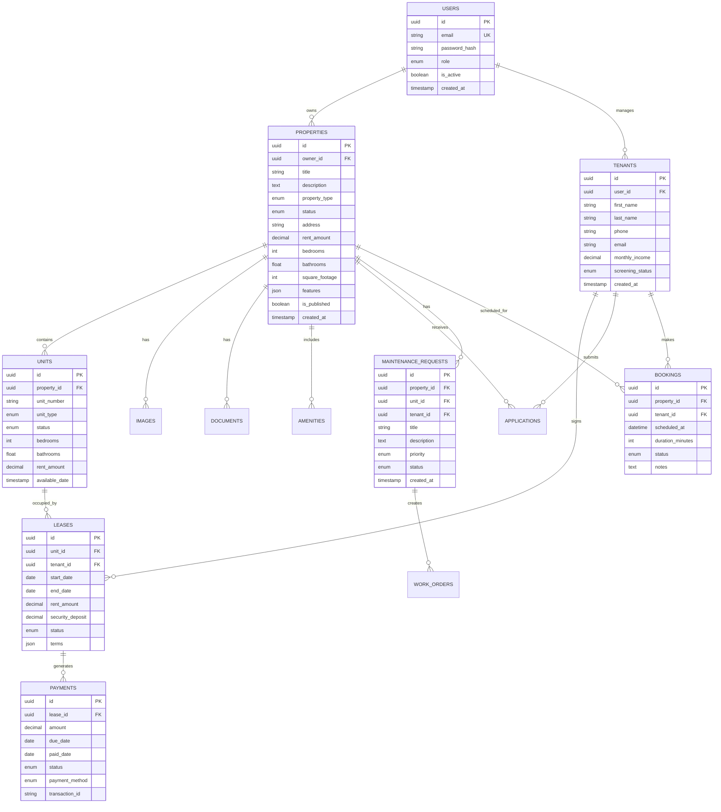

# PropFlow - Technical Architecture Documentation

## 🏗️ System Architecture Overview

PropFlow is built using a modern microservices architecture designed for scalability, maintainability, and cloud-native deployment. The platform follows Domain-Driven Design (DDD) principles with clear service boundaries.


## 🔧 Technology Stack

### Frontend
- **Framework**: Next.js 14 with App Router
- **Language**: TypeScript
- **Styling**: Tailwind CSS + Headless UI
- **State Management**: Zustand + React Query
- **Forms**: React Hook Form + Zod validation
- **Charts**: Recharts
- **Maps**: Mapbox GL JS

### Backend
- **Runtime**: Node.js 18+
- **Framework**: Express.js
- **Language**: TypeScript
- **API**: GraphQL with Apollo Federation
- **Authentication**: JWT + Passport.js
- **Validation**: Zod
- **File Upload**: Multer + Sharp

### AI Services
- **Framework**: FastAPI (Python)
- **LLM**: OpenAI GPT-4, Anthropic Claude
- **Vector DB**: Pinecone
- **ML Framework**: LangChain
- **Document Processing**: PyPDF2, python-docx

### Databases
- **Primary**: PostgreSQL 14+
- **Cache**: Redis 7+
- **Search**: Elasticsearch 8+
- **Analytics**: MongoDB 7+
- **File Storage**: AWS S3 / Google Cloud Storage

### Infrastructure
- **Containers**: Docker + Docker Compose
- **Orchestration**: Kubernetes / Google Cloud Run
- **CI/CD**: GitHub Actions
- **Infrastructure as Code**: Terraform
- **Monitoring**: Prometheus + Grafana
- **Logging**: ELK Stack

## 🔐 Security Architecture


### Security Features
- **Authentication**: Multi-factor authentication (2FA) with TOTP
- **Authorization**: Role-based access control (RBAC)
- **Data Protection**: End-to-end encryption, GDPR compliance
- **API Security**: Rate limiting, input validation, CORS
- **Infrastructure**: VPC isolation, security groups, SSL/TLS
- **Secrets Management**: Encrypted secret storage
- **Audit Logging**: Comprehensive security event logging

## 📊 Data Architecture



## 🚀 Deployment Architecture

### Google Cloud Run Deployment


### Container Architecture


## 🔄 API Architecture

### GraphQL Federation Schema


### API Patterns

#### Query Examples
```graphql
# Property Search with Federation
query SearchProperties($input: PropertySearchInput!) {
  searchProperties(input: $input) {
    properties {
      id
      title
      rentAmount
      images {
        url
        isPrimary
      }
      owner {
        id
        fullName
      }
      availableUnits {
        id
        rentAmount
        bedrooms
      }
    }
    total
    hasNextPage
  }
}

# Tenant Application with Cross-Service Data
query TenantApplication($id: ID!) {
  tenantApplication(id: $id) {
    id
    status
    tenant {
      id
      fullName
      creditScore
    }
    property {
      id
      title
      address
    }
    documents {
      id
      type
      status
    }
    payments {
      id
      amount
      status
    }
  }
}
```

## 🔍 Monitoring & Observability


## 📱 Mobile Architecture


## 🔧 Development Workflow


## 🚦 Performance Optimization

### Caching Strategy


### Database Optimization
- **Indexing**: Strategic indexing on frequently queried columns
- **Connection Pooling**: Efficient database connection management
- **Read Replicas**: Separate read/write operations
- **Query Optimization**: Optimized GraphQL resolvers to prevent N+1 queries

## 📊 Business Intelligence & Analytics


This architecture provides:
- **Scalability**: Microservices can scale independently
- **Reliability**: Fault isolation and graceful degradation
- **Maintainability**: Clear service boundaries and separation of concerns
- **Security**: Multiple layers of security controls
- **Performance**: Optimized caching and database strategies
- **Observability**: Comprehensive monitoring and logging
- **Cloud-Native**: Designed for modern cloud deployment