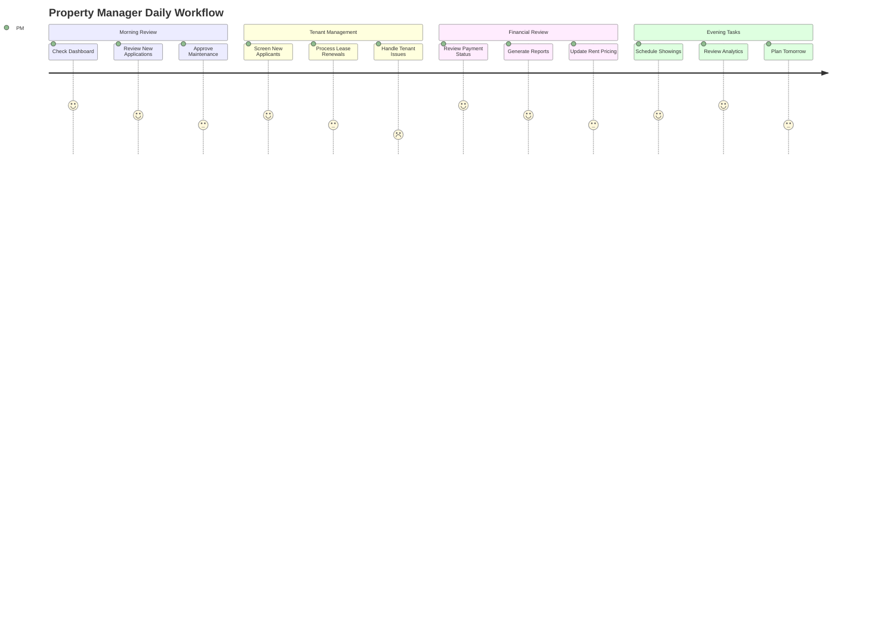
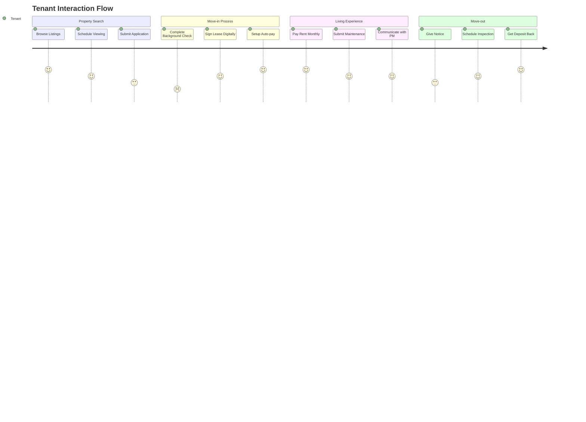

# PropFlow - Product Requirements Document (PRD)

## 📋 Executive Summary

**Product Name**: PropFlow  
**Version**: 1.0  
**Document Version**: 1.0  
**Date**: December 2024  
**Product Manager**: [Your Name]  
**Engineering Lead**: [Your Name]  

PropFlow is a comprehensive, AI-powered property management platform designed to streamline operations for property managers, landlords, and tenants. The platform combines modern technology with intelligent automation to create an efficient, scalable solution for property management workflows.

## 🎯 Product Vision & Goals

### Vision Statement
To revolutionize property management through intelligent automation, seamless communication, and data-driven insights, creating value for all stakeholders in the property ecosystem.

### Primary Goals
1. **Operational Efficiency**: Reduce manual tasks by 70% through automation
2. **Tenant Satisfaction**: Improve tenant experience with self-service capabilities
3. **Financial Optimization**: Increase NOI by 15% through better analytics and management
4. **Scalability**: Support property portfolios from 1 to 10,000+ units
5. **Market Leadership**: Become the go-to platform for modern property management

### Success Metrics
- **User Adoption**: 10,000+ active property managers in first year
- **Platform Usage**: 80% monthly active user rate
- **Customer Satisfaction**: NPS score of 70+
- **Operational Impact**: 70% reduction in manual tasks
- **Revenue Growth**: $5M ARR by end of year 2

## 👥 Target Users & Personas

### Primary Users

#### 1. Property Managers
- **Profile**: Professional property management companies
- **Pain Points**: Manual processes, tenant communication, maintenance coordination
- **Goals**: Efficiency, tenant retention, cost reduction, scalability
- **Use Cases**: Portfolio management, tenant screening, maintenance coordination

#### 2. Individual Landlords
- **Profile**: Private property owners (1-50 units)
- **Pain Points**: Time management, tenant issues, financial tracking
- **Goals**: Passive income optimization, minimal time investment
- **Use Cases**: Tenant management, rent collection, basic reporting

#### 3. Tenants
- **Profile**: Residential and commercial renters
- **Pain Points**: Communication issues, maintenance delays, payment hassles
- **Goals**: Convenient living experience, quick issue resolution
- **Use Cases**: Rent payments, maintenance requests, communication

### Secondary Users

#### 4. Maintenance Staff
- **Profile**: In-house and contractor maintenance teams
- **Goals**: Efficient work order management, clear communication
- **Use Cases**: Work order tracking, scheduling, inventory management

#### 5. Real Estate Agents
- **Profile**: Agents specializing in rental properties
- **Goals**: Streamlined showing process, lead management
- **Use Cases**: Property tours, lead qualification, application processing

## 🔧 Core Features & Requirements

### 🏠 Core Property Management

#### Feature 1: Property Portfolio Management
**Priority**: P0 (Must Have)  
**Implementation Status**: ✅ Complete

| Feature Component | Description | Status | Acceptance Criteria |
|------------------|-------------|--------|-------------------|
| Property CRUD | Create, read, update, delete properties | ✅ Complete | - Multi-property support - Rich property details - Image management |
| Property Search | Advanced search and filtering | ✅ Complete | - Location-based search - Price/size filters - Keyword search |
| Unit Management | Individual unit tracking | ✅ Complete | - Unit-level details - Availability tracking - Rent management |
| Property Analytics | Performance metrics and reporting | ✅ Complete | - Occupancy rates - Revenue tracking - ROI calculations |

#### Feature 2: Tenant Management & Screening
**Priority**: P0 (Must Have)  
**Implementation Status**: 🔄 In Progress

| Feature Component | Description | Status | Acceptance Criteria |
|------------------|-------------|--------|-------------------|
| Tenant Profiles | Comprehensive tenant information | 🔄 In Progress | - Personal details - Employment history - References |
| Application Processing | Digital rental applications | 🔄 In Progress | - Online forms - Document upload - Status tracking |
| Background Screening | Credit and background checks | ❌ Not Started | - Credit score integration - Criminal background - Employment verification |
| Tenant Portal | Self-service tenant interface | ❌ Not Started | - Payment portal - Maintenance requests - Document access |

#### Feature 3: Lease Management
**Priority**: P0 (Must Have)  
**Implementation Status**: ❌ Not Started

| Feature Component | Description | Status | Acceptance Criteria |
|------------------|-------------|--------|-------------------|
| Lease Creation | Digital lease generation | ❌ Not Started | - Template management - Custom terms - Digital signatures |
| Lease Tracking | Active lease monitoring | ❌ Not Started | - Expiration alerts - Renewal workflow - Amendment tracking |
| Renewal Management | Automated renewal process | ❌ Not Started | - Automated notifications - Rate adjustments - Renewal offers |

#### Feature 4: Maintenance Management
**Priority**: P0 (Must Have)  
**Implementation Status**: ❌ Not Started

| Feature Component | Description | Status | Acceptance Criteria |
|------------------|-------------|--------|-------------------|
| Work Order System | Maintenance request tracking | ❌ Not Started | - Request submission - Priority management - Status tracking |
| Vendor Management | Contractor coordination | ❌ Not Started | - Vendor profiles - Scheduling - Performance tracking |
| Preventive Maintenance | Scheduled maintenance | ❌ Not Started | - Maintenance schedules - Automated reminders - Asset tracking |

### 💰 Financial Management

#### Feature 5: Payment Processing
**Priority**: P0 (Must Have)  
**Implementation Status**: 🔄 In Progress

| Feature Component | Description | Status | Acceptance Criteria |
|------------------|-------------|--------|-------------------|
| Rent Collection | Automated rent processing | 🔄 In Progress | - Multiple payment methods - Recurring payments - Late fee automation |
| Payment Tracking | Transaction monitoring | 🔄 In Progress | - Payment history - Failed payment handling - Reconciliation |
| Financial Reporting | Revenue and expense reporting | ❌ Not Started | - P&L statements - Cash flow analysis - Tax reporting |

#### Feature 6: Accounting Integration
**Priority**: P1 (Should Have)  
**Implementation Status**: ❌ Not Started

| Feature Component | Description | Status | Acceptance Criteria |
|------------------|-------------|--------|-------------------|
| Expense Tracking | Operating expense management | ❌ Not Started | - Expense categorization - Receipt management - Approval workflows |
| Financial Analytics | Advanced financial insights | ❌ Not Started | - ROI analysis - Benchmarking - Forecasting |

### 🤖 AI-Powered Features

#### Feature 7: Intelligent Chatbot
**Priority**: P1 (Should Have)  
**Implementation Status**: 🔄 In Progress

| Feature Component | Description | Status | Acceptance Criteria |
|------------------|-------------|--------|-------------------|
| Tenant Support | AI-powered tenant assistance | 🔄 In Progress | - 24/7 availability - Common query handling - Escalation to humans |
| Property Inquiries | Lead qualification | 🔄 In Progress | - Automated responses - Lead scoring - Booking assistance |
| Multi-language Support | Localization | ❌ Not Started | - Multiple languages - Cultural adaptation - Regional compliance |

#### Feature 8: Document Automation
**Priority**: P1 (Should Have)  
**Implementation Status**: ❌ Not Started

| Feature Component | Description | Status | Acceptance Criteria |
|------------------|-------------|--------|-------------------|
| Lease Generation | AI-powered lease creation | ❌ Not Started | - Template selection - Custom clause insertion - Compliance checking |
| Document Processing | Intelligent document handling | ❌ Not Started | - OCR capabilities - Data extraction - Validation |

#### Feature 9: Predictive Analytics
**Priority**: P2 (Could Have)  
**Implementation Status**: ❌ Not Started

| Feature Component | Description | Status | Acceptance Criteria |
|------------------|-------------|--------|-------------------|
| Maintenance Prediction | Predictive maintenance alerts | ❌ Not Started | - Equipment failure prediction - Cost optimization - Scheduling recommendations |
| Market Analysis | Rental market insights | ❌ Not Started | - Pricing recommendations - Market trends - Competitive analysis |
| Tenant Behavior | Tenant lifecycle analytics | ❌ Not Started | - Retention prediction - Risk assessment - Satisfaction scoring |

### 📱 Communication & Booking

#### Feature 10: Multi-Channel Communication
**Priority**: P0 (Must Have)  
**Implementation Status**: ❌ Not Started

| Feature Component | Description | Status | Acceptance Criteria |
|------------------|-------------|--------|-------------------|
| Messaging System | In-app messaging | ❌ Not Started | - Real-time chat - File sharing - Message history |
| Email Automation | Automated email workflows | ❌ Not Started | - Template management - Triggered emails - Tracking |
| SMS Notifications | Text message alerts | ❌ Not Started | - Emergency notifications - Payment reminders - Appointment confirmations |

#### Feature 11: Property Viewing System
**Priority**: P1 (Should Have)  
**Implementation Status**: ❌ Not Started

| Feature Component | Description | Status | Acceptance Criteria |
|------------------|-------------|--------|-------------------|
| Booking Calendar | Appointment scheduling | ❌ Not Started | - Available time slots - Conflict resolution - Automated confirmations |
| Virtual Tours | 360° property tours | ❌ Not Started | - Interactive walkthroughs - Mobile compatibility - Scheduling integration |
| Self-Showing | Automated property access | ❌ Not Started | - Smart lock integration - Identity verification - Access tracking |

### 📊 Analytics & Reporting

#### Feature 12: Business Intelligence
**Priority**: P1 (Should Have)  
**Implementation Status**: 🔄 In Progress

| Feature Component | Description | Status | Acceptance Criteria |
|------------------|-------------|--------|-------------------|
| Dashboard Analytics | Real-time KPI monitoring | 🔄 In Progress | - Customizable dashboards - Real-time updates - Mobile access |
| Custom Reports | Flexible reporting engine | ❌ Not Started | - Report builder - Scheduled reports - Export capabilities |
| Benchmarking | Industry comparisons | ❌ Not Started | - Market benchmarks - Performance scoring - Improvement recommendations |

### 🔐 Security & Compliance

#### Feature 13: Data Security
**Priority**: P0 (Must Have)  
**Implementation Status**: ✅ Complete

| Feature Component | Description | Status | Acceptance Criteria |
|------------------|-------------|--------|-------------------|
| Authentication | Secure user authentication | ✅ Complete | - Multi-factor authentication - SSO integration - Password policies |
| Data Encryption | End-to-end encryption | ✅ Complete | - Data at rest encryption - TLS for data in transit - Key management |
| Access Control | Role-based permissions | ✅ Complete | - Granular permissions - Role management - Audit trails |

#### Feature 14: Compliance Management
**Priority**: P0 (Must Have)  
**Implementation Status**: 🔄 In Progress

| Feature Component | Description | Status | Acceptance Criteria |
|------------------|-------------|--------|-------------------|
| GDPR Compliance | Data privacy compliance | 🔄 In Progress | - Data portability - Right to deletion - Consent management |
| SOC 2 Compliance | Security compliance | 🔄 In Progress | - Security controls - Audit readiness - Continuous monitoring |

## 📱 Platform Support

### Web Application
- **Framework**: Next.js 14 with React 18
- **Browser Support**: Chrome 90+, Firefox 88+, Safari 14+, Edge 90+
- **Responsive Design**: Desktop, tablet, mobile optimized
- **PWA Features**: Offline capabilities, push notifications

### Mobile Application
- **Platform**: React Native (iOS & Android)
- **Minimum OS**: iOS 13+, Android 8.0+
- **Features**: Native notifications, camera access, biometric auth
- **Distribution**: App Store, Google Play Store

### API Platform
- **Architecture**: GraphQL Federation
- **Documentation**: Auto-generated with Apollo Studio
- **Rate Limiting**: Tier-based API limits
- **Versioning**: Semantic versioning with deprecation notices

## 🔄 User Journey Flows

### Property Manager Journey

### Tenant Journey

## 🛠️ Technical Requirements

### Performance Requirements
- **Page Load Time**: < 2 seconds for 95% of requests
- **API Response Time**: < 500ms for 95% of API calls
- **Uptime**: 99.9% availability SLA
- **Scalability**: Support for 100,000+ concurrent users

### Security Requirements
- **Data Encryption**: AES-256 encryption for data at rest
- **Transport Security**: TLS 1.3 for all communications
- **Authentication**: Multi-factor authentication mandatory
- **Access Control**: Role-based access with audit logging

### Integration Requirements
- **Payment Gateways**: Stripe, PayPal, ACH processing
- **Communication**: Twilio (SMS), SendGrid (Email)
- **Maps & Location**: Google Maps API
- **AI Services**: OpenAI GPT-4, Anthropic Claude
- **Document Storage**: AWS S3, Google Cloud Storage

## 📊 Feature Priority Matrix

| Feature Category | P0 (Must Have) | P1 (Should Have) | P2 (Could Have) | P3 (Won't Have) |
|-----------------|----------------|------------------|-----------------|-----------------|
| **Property Management** | Property CRUD, Search, Units | Advanced Analytics | IoT Integration | VR Tours |
| **Tenant Management** | Basic Profiles, Applications | Background Screening | Behavior Analytics | Social Features |
| **Financial** | Payment Processing | Advanced Reporting | Forecasting | Investment Tools |
| **AI Features** | Basic Chatbot | Document Automation | Predictive Analytics | Advanced ML |
| **Communication** | Messaging, Email | Video Calls | SMS Marketing | Social Media |
| **Mobile** | Core Features | Push Notifications | Offline Mode | AR Features |

## 🎯 Success Criteria & KPIs

### User Engagement
- **Daily Active Users**: 70% of monthly users
- **Session Duration**: Average 15+ minutes
- **Feature Adoption**: 80% of users use core features
- **User Retention**: 90% monthly retention

### Business Impact
- **Operational Efficiency**: 70% reduction in manual tasks
- **Cost Savings**: 30% reduction in operational costs
- **Revenue Impact**: 15% increase in NOI for users
- **Customer Satisfaction**: NPS score of 70+

### Technical Performance
- **System Availability**: 99.9% uptime
- **Response Time**: <500ms for 95% of requests
- **Error Rate**: <0.1% of all requests
- **Scalability**: Linear scaling to 100K+ users

## 🚀 Release Plan & Milestones

### Phase 1: MVP (Q1 2025)
- ✅ Core property management
- ✅ Basic tenant management
- ✅ Payment processing
- ✅ Authentication & security
- ✅ Basic mobile app

### Phase 2: Growth (Q2 2025)
- 🔄 Advanced search and filtering
- 🔄 Maintenance management
- 🔄 Financial reporting
- 🔄 AI chatbot
- 🔄 Communication system

### Phase 3: Scale (Q3 2025)
- ❌ Document automation
- ❌ Predictive analytics
- ❌ Advanced integrations
- ❌ Enterprise features
- ❌ API marketplace

### Phase 4: Innovation (Q4 2025)
- ❌ IoT integration
- ❌ Advanced AI features
- ❌ Blockchain integration
- ❌ Advanced analytics
- ❌ International expansion

## 🔍 Competitive Analysis

### Direct Competitors
1. **Buildium**: Strong in accounting, weak in AI features
2. **AppFolio**: Good mobile app, limited customization
3. **RentManager**: Enterprise-focused, complex UI
4. **Yardi**: Market leader, expensive, legacy system

### Competitive Advantages
- **AI-First Approach**: Built-in AI from day one
- **Modern UX**: Intuitive, mobile-first design
- **Fair Pricing**: Transparent, usage-based pricing
- **Open Platform**: Extensive API and integrations
- **Cloud Native**: Built for scale and performance

## 💰 Pricing Strategy

### Freemium Model
- **Free Tier**: Up to 5 units, basic features
- **Starter**: $29/month for up to 25 units
- **Professional**: $99/month for up to 100 units
- **Enterprise**: Custom pricing for 100+ units

### Value-Based Pricing
- **Cost Savings**: Price based on operational savings
- **Performance Metrics**: Success-based pricing tiers
- **ROI Guarantee**: Money-back guarantee for first year

## 🔮 Future Roadmap

### 2025 Roadmap
- Q1: MVP launch with core features
- Q2: AI features and advanced analytics
- Q3: Enterprise features and integrations
- Q4: International expansion and compliance

### Long-term Vision (2026+)
- **Global Platform**: Multi-country, multi-currency support
- **AI Ecosystem**: Comprehensive AI-powered automation
- **Marketplace**: Third-party app and service marketplace
- **Industry Leader**: Dominant position in proptech space

---

This PRD serves as the single source of truth for PropFlow's product development, ensuring alignment across all stakeholders and clear success metrics for each feature and release.